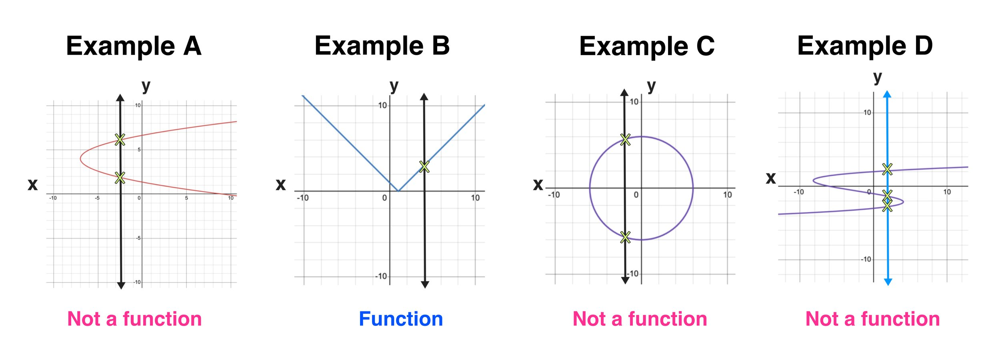
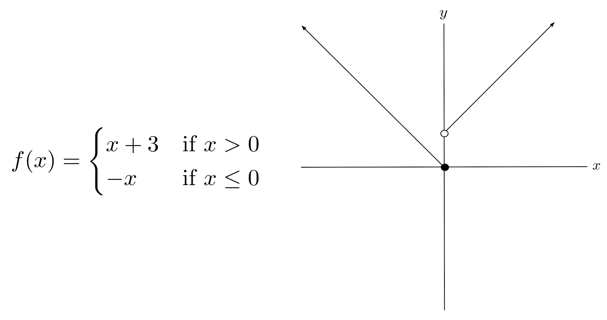
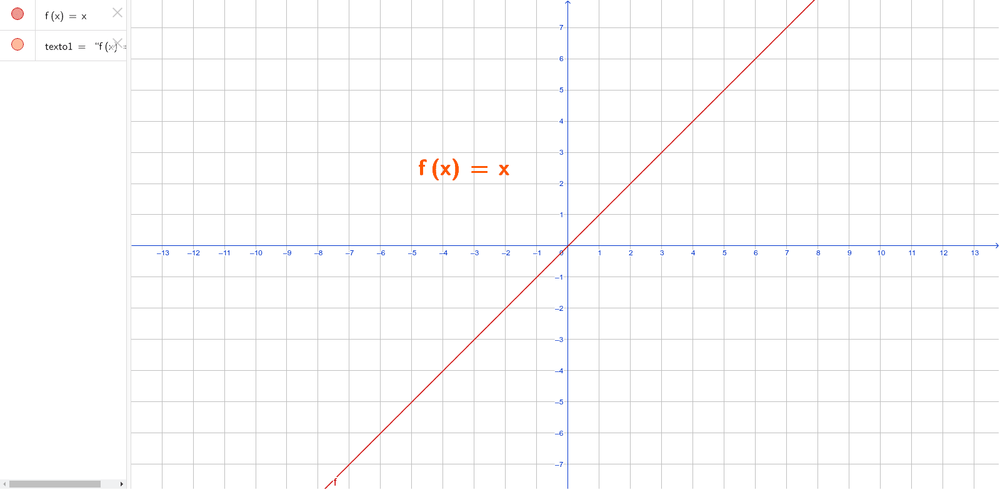
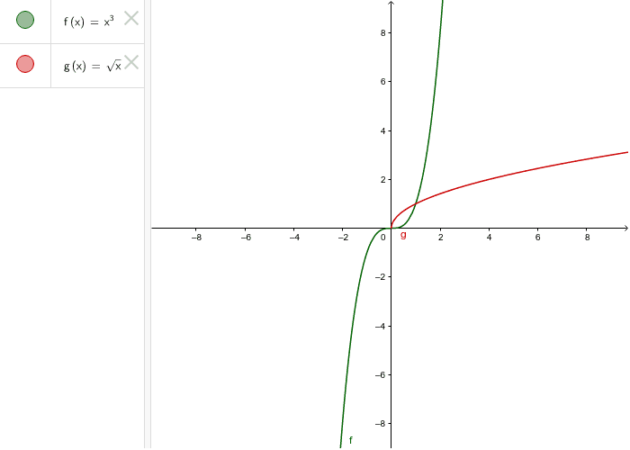

## Pre-Calc

### Important Math Notations

**Inclusive set** [ ] <br>
**Exclusive set** ( ) - always used with $\infty$

### Intro to Functions
A function is a relationship that maps **one input** ($x$ values) to **one output** ($y$ or $f(x)$ values). An input **never** gives more than 1 output

> **Example 1:** two inputs share one output - still a function

| Work Hours |   | Pay |
|-----------:|:-:|----:|
| 2 hrs      | → | $30 |
| 4 hrs      | → | $60 |
| 6 hrs      | → | $90 |
| 8 hrs      | → | $90 |  

$S = \set{(-2, 16), (-1,4), (0,3)}$<br>
$y = -7x +5$<br>
$y= 2x^2 -5x +4$<br>

> **Example 2:** one input has two outputs - not a function

| Work Hours |   | Pay |
|-----------:|:-:|----:|
| 2 hrs      | → | $30 |
| 4 hrs      | → | $60 |
| 4 hrs      | → | $90 |

$R = \set{(-2, 16), (-1,4), (-2,16)}$<br>
$y = \pm\sqrt{3-2x}$

**Domain:** Set of inputs<br>
**Range:** Set of outputs

### Finding Domain

**Domain:** Set of inputs of a function that give a **real** number output, square roots need to be positive.
Domain of root functions carries through operations. Always find domain of function before operations.

> **Example 1:** Finding solution to equality

$f(x) = \sqrt{5-4x}$<br>$5-4x \ge 0$<br>$x \ge \frac{5}{4}$<br>

Domain = $\{\, x \mid x \le \frac{5}{4}\,\}$

> **Example 2:** Denominators can never equal 0

$g(t) = \frac{5t}{t^3 -16t}$<br>$t^3 - 16t = 0$<br>$t(t^2 -16) = 0$<br>$t(t-4)(t+4) = 0$<br>

$D:\{\, t \mid t\in\mathbb{R}, t \neq -4, t \neq 0, t \neq 4\,\}$<br>
$(-\infty, -4) \cup (-4, 0) \cup (0, 4) \cup (4, \infty)$

> **Example 3:** Vertical line test



**Even function** symmetric about the y-axis <br>
$f(x) = f(-x)$

**Odd function** Symmetric about the origin - totate 180 and fold twice over y then x <br>
$-f(x) = f(-x)$


**Increasing** $x_1 < x_2$ for $f(x_1) < f(x_2)$ <br>
**Decreasing** $ x_1 < x_2$ for $f(x_1) > f(x_2)$<br>
**Local/Relative Max** On an open interval $f(x) \le f(c)$ where $c$ is a local max. Function changes from increasing to decreasing. Cannot ocur at an endpoint.<br>
**Local/Relative Min** $f(x) \ge f(c)$ where $c$ is a local min. Function changes from decreasing to increasing. Cannot occur at an endpoint. <br>
**Absolute Max** Highest output of the function. Can occur at endpoints<br>
**Absolute Min** Lowest output of the function. Can occur at endpoints.<br>
**Average rate of change** $\frac{f(b) - f(a)}{b-a}$<br>
> **Example** Find Average rate of change of $f(x) = x^2 - 2x$ from $x = 3$ to $x=5$<br>
$f(3) = 9-6 = 3$<br>
$f(5) = 25-10 = 15$<br>
Average rate of change $ \frac{15 -3}{5-3} = \frac{12}{2} = 6$
**Equation of a line** $y -y_1 = m(x-x_1)$<br>
**Piece-wise functions**<br>


**Popular graphs**<br>
$f(x) = 3$ <br>
<br>
$f(x) = x$<br>
<br>
$f(x) = \sqrt[3]{x}$
<br>
$f(x) = \abs{x}$
<br>

<!-- Simple vertical-line test diagram -->
<svg width="220" height="220" viewBox="-11 -11 22 22">
  <!-- Axes -->
  <line x1="-10" y1="0"  x2="10" y2="0"  stroke="#888" stroke-width="0.2"/>
  <line x1="0"  y1="-10" x2="0" y2="10" stroke="#888" stroke-width="0.2"/>

  <!-- Example curve (half of a sideways parabola) -->
  <path d="M -9 9 Q -4 0 1 9" fill="none" stroke="#0645AD" stroke-width="0.4"/>

  <!-- Vertical test line  -->
  <line x1="-3" y1="-10" x2="-3" y2="10" stroke="crimson" stroke-width="0.4"/>

  <!-- Optional annotation -->
  <text x="-3" y="-10.5" font-size="0.8" text-anchor="middle" fill="crimson">x = −3</text>
</svg>

## Domain → Codomain (Vertical-Line Test)

```mermaid
graph TD
  x1[(−3)] --> y1[(5)]
  x2[(−3)] --> y2[(−5)]
