# Pre-Calc

## Contents

[Important Math Notations/Definitions](#important-math-notationsdefinitions) 
[Functions](#functions) 
[Finding Domain](#finding-domain) 
[Properties of a function](#properties-of-a-function) 
[Average rate of change](#average-rate-of-change) 
[Popular graphs](#popular-graphs) 
[Transformations](#transformations) 
[Solving Quadratics](#solving-quadratics) 
[Polynomial Functions](#polynomial-functions) 
[Power Functions](#power-functions) 

### Important Math Notations/Definitions

**Inclusive set** [ ]  
**Exclusive set** ( ) - always used with $\infty$ 
**Domain:** Set of inputs of a function that give a **real** number output, square roots need to be positive. Always find domain of function before operations. 
**Range:** Set of outputs 
**Codomain:** Domain of the output 
**Intersection:** $a \cap b$ has the elements which are common to both set a and set b. 
**Union:** $a \cup b$ contains all elements that are in at least one of the sets with duplicates removed.  

### Functions
A function is a relationship that maps **one input** ($x$ values) to **one output** ($y$ or $f(x)$ values). An input **never** gives more than 1 output.

**Even function** symmetric about the y-axis  
$f(x) = f(-x)$

**Odd function** Symmetric about the origin - rotate 180 and fold twice over y then x  
$-f(x) = f(-x)$

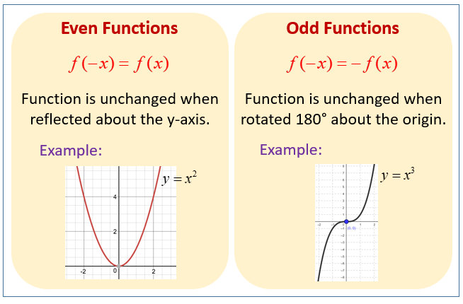 

> **Example 1:** two inputs share one output - still a function

| Work Hours |   | Pay |
|-----------:|:-:|----:|
| 2 hrs      | → | $30 |
| 4 hrs      | → | $60 |
| 6 hrs      | → | $90 |
| 8 hrs      | → | $90 |  

$S = \set{(-2, 16), (-1,4), (0,3)}$ 
$y = -7x +5$ 
$y= 2x^2 -5x +4$ 

> **Example 2:** one input has two outputs - not a function

| Work Hours |   | Pay |
|-----------:|:-:|----:|
| 2 hrs      | → | $30 |
| 4 hrs      | → | $60 |
| 4 hrs      | → | $90 |

$R = \set{(-2, 16), (-1,4), (-2,16)}$ 
$y = \pm\sqrt{3-2x}$

> **Example 3:** Denominators can never equal 0

$g(t) = \frac{5t}{t^3 -16t}$ $t^3 - 16t = 0$ $t(t^2 -16) = 0$ $t(t-4)(t+4) = 0$ 

$D:\{\, t \mid t\in\mathbb{R}, t \neq -4, t \neq 0, t \neq 4\,\}$ 
$(-\infty, -4) \cup (-4, 0) \cup (0, 4) \cup (4, \infty)$

> **Example 4:** Vertical line test 
If a vertical line passes through the graph more than once - not a function.  
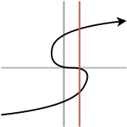 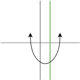

### Finding Domain

> **Example 1:** Finding solution to equality

$f(x) = \sqrt{5-4x}$ $5-4x \ge 0$ $x \ge \frac{5}{4}$ 

Domain = $\set{x \mid x \le \frac{5}{4}}$

### Properties of a function

**Equation of a line** $y -y_1 = m(x-x_1)$ 
**Increasing** $x_1 < x_2$ for $f(x_1) < f(x_2)$ 
**Decreasing** $x_1 < x_2$ for $f(x_1) > f(x_2)$ 
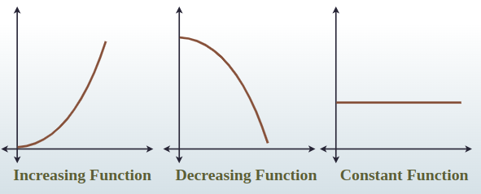 

**Local/Relative Max** On an open interval $f(x) \le f(c)$ where $c$ is a local max. Function changes from increasing to decreasing. Cannot ocur at an endpoint. 
**Local/Relative Min** $f(x) \ge f(c)$ where $c$ is a local min. Function changes from decreasing to increasing. Cannot occur at an endpoint.  
**Absolute Max** Highest output of the function. Can occur at endpoints. 
**Absolute Min** Lowest output of the function. Can occur at endpoints. 
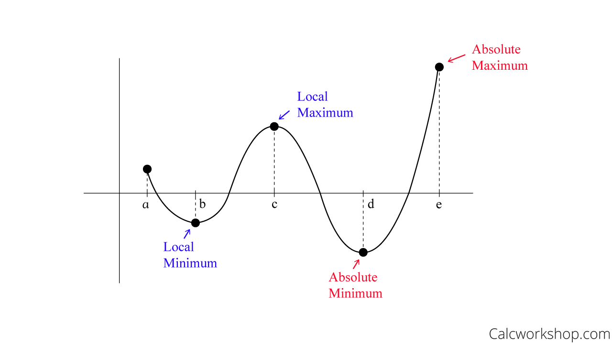 

### Average rate of change 

$\frac{f(b) - f(a)}{b-a}$ 
> **Example** Find Average rate of change of $f(x) = x^2 - 2x$ from $x = 3$ to $x=5$ 
$f(3) = 9-6 = 3$ 
$f(5) = 25-10 = 15$ 
Average rate of change $\frac{15 -3}{5-3} = \frac{12}{2} = 6$ 

### Popular graphs

Piece-wise functions 
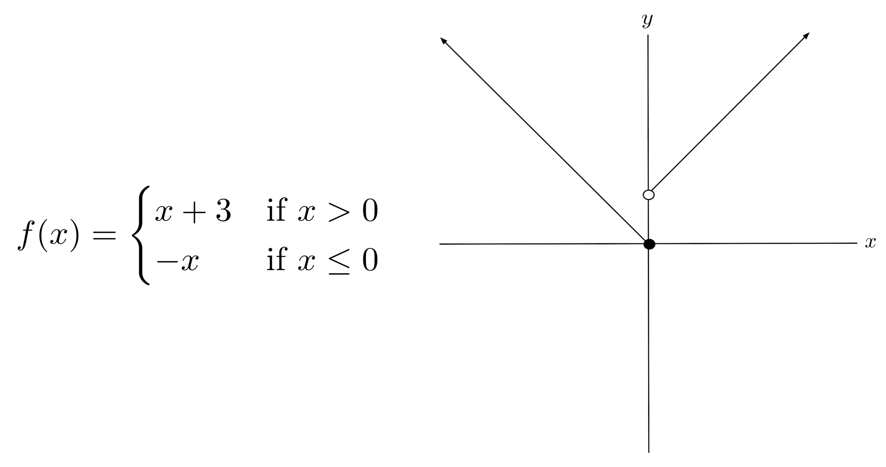

$f(x) = 3$  
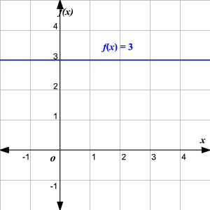 

$f(x) = x$ 
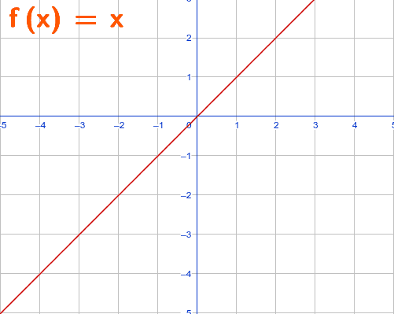 

$f(x) = \sqrt[3]{x}$ and $f(x) = \sqrt[2]{x}$ 
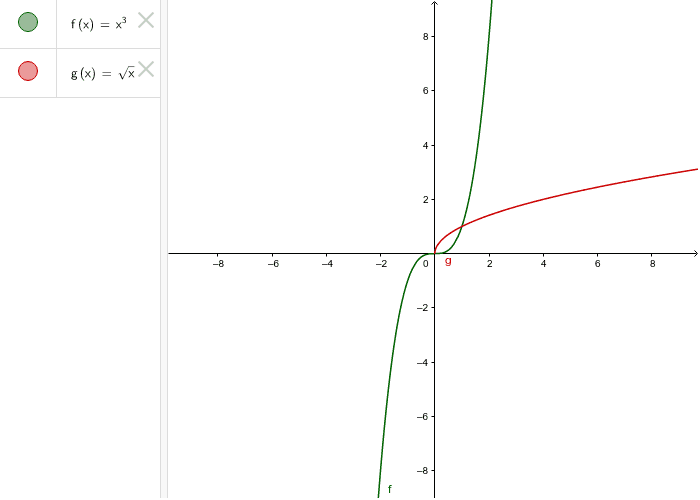 

$f(x) = |x|$ 
 

$f(x) = \frac{1}{x}$ 
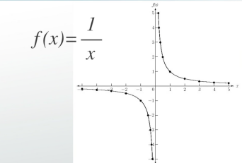 

### Transformations 
**Vertical:**  
$f(x) + k$ - shift up 
$f(x) -k$ - shift down 
When $y = af(x)$: 
$a>1$ stretch 
$a<1$ compress 

**Horizontal:** 
$f(x+h)$ shift left  
$f(x-h)$ shift right  

**Reflection:** 
$y = -f(x)$ reflect x-axis 
$y = f(-x)$ reflect y-axis 

Odd key points (plot these to find shape) 
$(1, 1)$
$(0, 0)$
$(-1, -1)$

Even key points(plot these to find shape) 
$(1, 1)$
$(0, 0)$
$(-1, 1)$

### Quadratics

$f(x) = ax^{2} +bx +c$ --> $x = \frac{-b \pm\sqrt{b^{2} - 4ac}}{2a}$ 
if discriminant > 0 -> 2 solutions
if discriminant = 0 -> 1 solution
if discriminant < 0 -> no real solution

> **Square Root Method** 
Get $x^2$ by itself - no other x's in the equation

1. $f(x) = x^{2} -18$ 
   $x^{2} = 18$ 
   $x = \pm\sqrt{18} = \pm\sqrt{9 \cdot 2} = \pm 3 \sqrt{2}$ 
2. $h(x) = (2x +3)^{2} - 32$  
   $(2x+3)^{2} = 32$ 
   $(2x+3) = \pm\sqrt{32} = \pm\sqrt{2 \cdot 16} = \pm\sqrt{2 \cdot 4 \cdot 4} = \pm 4 \sqrt{2}$ 
   $2x = -3 \pm 4 \sqrt{2}$ 
   $x = \frac{-3 \pm 4 \sqrt{2}}{2}$ 
3. $f(x) = (3x -2)^{2} + 75$ 
   $(3x-2)^{2} = -75$ 
   $3x -2 = \pm\sqrt{-75}$ --> No real solution - graph is not touching the x-axis 
   $3x -2 = \pm\sqrt{ -1 \cdot 25 \cdot 3} = 5i\sqrt{3}$
   $x = \frac{2 \pm 5i \sqrt{3}}{3}$ --> Complex conjugate in the complex form of $a +bi$ 

>**Factoring by Diamond Method**

 

**Steps:**
1. Fill out the diamond.
   $b$ is the coefficient of $x$
   $a \cdot c$ is the product of the leading and constant coefficients
   $m$ such that $m + n = b$
   $n$ such that $m \cdot n = a \cdot c$
2. Solution is $ax^{2} + bx +c = ax^{2} + mx + nx + c$
3. Factor by grouping 
   $(ax^{2} + mx) + (nx+c)$ 
   Factor out GCF 
   $x(ax +m) + 1(nx+c)$ 
   If successful, the parenthesis match 
   $(ax +m)(x+n) = 0$

**Examples:**
1. $f(x) = x^{2} + 7x +6$ 
   $x^{2} + 7x + 6 = 0$ 
   $b = 7, a \cdot c = 6, m = 1, n = 6$ 
   $x(x+1)+6(x+1) = 0$ 
   $(x+1)(x+6) = 0$ 
   $x=-1, x= -6$ 
2. $h(x) = -12x +9 +4x^{2}$ 
   $4x^{2} -12x +9 = 0$ 
   $b = -12, a \cdot c = 36, m = -6, n = -6$ 
   $(2x -3)^{2} = 0$
   $x = \frac{3}{2}$

>**Completing the Square**

1. $f(x)= x^{2} +4x -3$ 
   $(x^{2} +4x) - 3 = 0$ 
   $(x +2)^{2} -4 -3 =0$ 
   $(x+2)^{2} - 7 = 0$ 
2. $h(x) = 5x^{2} -10x +2$ 
   $x^{2} - 2x + \frac{2}{5}$ 
   $(x-1)^{2} - \frac{3}{5}=0$

>**Graphs of quadratics**

 

$f(x) = ax^{2} + bx +c$ 
$a>0$ Upward parabola 
$a<0$ Downward parabola 
y-intercept = (0,c) 
x-intercept: $ax^{2} + bx +c = 0$ 
Vertex = $(\frac{-b}{2a}, f(x))$ 
Vertex form: $f(x) = a(x + h)^{2} + k$

### Polynomial Functions

$f(x) = a_{n}x^{n} + a_{n-1}x^{n-1} + ... + a_{2}x^{2} + a_{1}x + a_0$ 
leading term: $a_{n}x^{n}$, constant term: $a_0$ 
Degree: $n$, largest exponent in polynomial
Domain is all $\mathbb{R}$

### Power Functions
Definition: Polynomial with only one term 
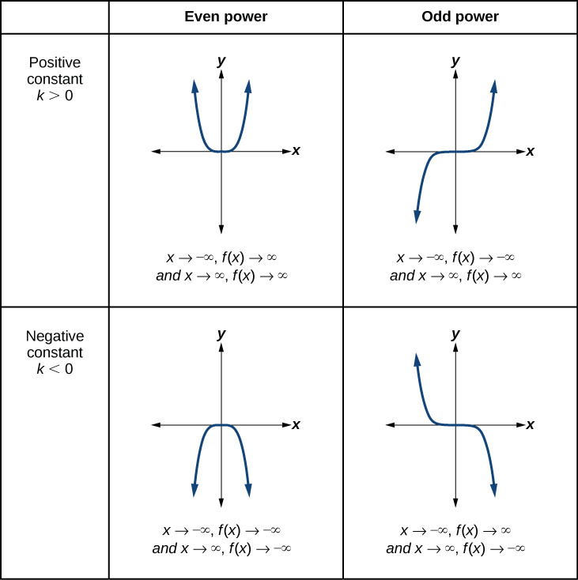

