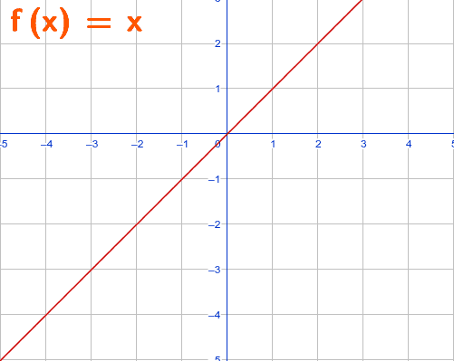

## Pre-Calc

### Important Math Notations/Definitions

**Inclusive set** [ ]  
**Exclusive set** ( ) - always used with $\infty$ 
**Domain:** Set of inputs of a function that give a **real** number output, square roots need to be positive. 
**Range:** Set of outputs

### Intro to Functions
A function is a relationship that maps **one input** ($x$ values) to **one output** ($y$ or $f(x)$ values). An input **never** gives more than 1 output.

> **Example 1:** two inputs share one output - still a function

| Work Hours |   | Pay |
|-----------:|:-:|----:|
| 2 hrs      | → | $30 |
| 4 hrs      | → | $60 |
| 6 hrs      | → | $90 |
| 8 hrs      | → | $90 |  

$S = \set{(-2, 16), (-1,4), (0,3)}$ 
$y = -7x +5$ 
$y= 2x^2 -5x +4$ 

> **Example 2:** one input has two outputs - not a function

| Work Hours |   | Pay |
|-----------:|:-:|----:|
| 2 hrs      | → | $30 |
| 4 hrs      | → | $60 |
| 4 hrs      | → | $90 |

$R = \set{(-2, 16), (-1,4), (-2,16)}$ 
$y = \pm\sqrt{3-2x}$

### Finding Domain

Domains of root functions carries through operations. Always find domain of function before operations.

> **Example 1:** Finding solution to equality

$f(x) = \sqrt{5-4x}$ $5-4x \ge 0$ $x \ge \frac{5}{4}$ 

Domain = $\set{x \mid x \le \frac{5}{4}}$

> **Example 2:** Denominators can never equal 0

$g(t) = \frac{5t}{t^3 -16t}$ $t^3 - 16t = 0$ $t(t^2 -16) = 0$ $t(t-4)(t+4) = 0$ 

$D:\{\, t \mid t\in\mathbb{R}, t \neq -4, t \neq 0, t \neq 4\,\}$ 
$(-\infty, -4) \cup (-4, 0) \cup (0, 4) \cup (4, \infty)$

> **Example 3:** Vertical line test 
 

**Even function** symmetric about the y-axis  
$f(x) = f(-x)$

**Odd function** Symmetric about the origin - totate 180 and fold twice over y then x  
$-f(x) = f(-x)$

 

**Increasing** $x_1 < x_2$ for $f(x_1) < f(x_2)$  
**Decreasing** $ x_1 < x_2$ for $f(x_1) > f(x_2)$ 
**Local/Relative Max** On an open interval $f(x) \le f(c)$ where $c$ is a local max. Function changes from increasing to decreasing. Cannot ocur at an endpoint. 
**Local/Relative Min** $f(x) \ge f(c)$ where $c$ is a local min. Function changes from decreasing to increasing. Cannot occur at an endpoint.  
**Absolute Max** Highest output of the function. Can occur at endpoints 
**Absolute Min** Lowest output of the function. Can occur at endpoints. 
**Average rate of change** $\frac{f(b) - f(a)}{b-a}$ 
> **Example** Find Average rate of change of $f(x) = x^2 - 2x$ from $x = 3$ to $x=5$ 
$f(3) = 9-6 = 3$ 
$f(5) = 25-10 = 15$ 
Average rate of change $ \frac{15 -3}{5-3} = \frac{12}{2} = 6$
**Equation of a line** $y -y_1 = m(x-x_1)$ 
**Piece-wise functions** 

**Popular graphs** 
$f(x) = 3$  
 

$f(x) = x$ 
 

$f(x) = \sqrt[3]{x}$ 
 

$f(x) = |x|$ 
 

## Transformations 
vertical: $f(x) + k$ - shift up 
$f(x) -k$ - shift down 

horizontal: $f(x+h)$ shift left
$f(x-h)$ shift rifht

Odd key points 
$(1, 1)$
$(0, 0)$
$(-1, -1)$

Even key points 
$(1, 1)$
$(0, 0)$
$(-1, 1)$

Vertical stretch/compression 
$y = af(x)$
$a>1$ stretch
$a<1$ compress

Can change horizontal into vertical
Reflection:
$y = -f(x)$ reflect x-axis
$y = f(-x)$ reflect y-axis

## Solving Quadratics

Quadratic
$f(x) = ax^{2} +bx +c$
Solutions: 
 

>**Square Root Method**
Get $x^2$ by itself - no other x's in the equation

1. $f(x) = x^{2} -18$ 
   $x^{2} = 18$ 
   $x = $

