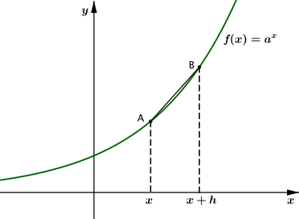
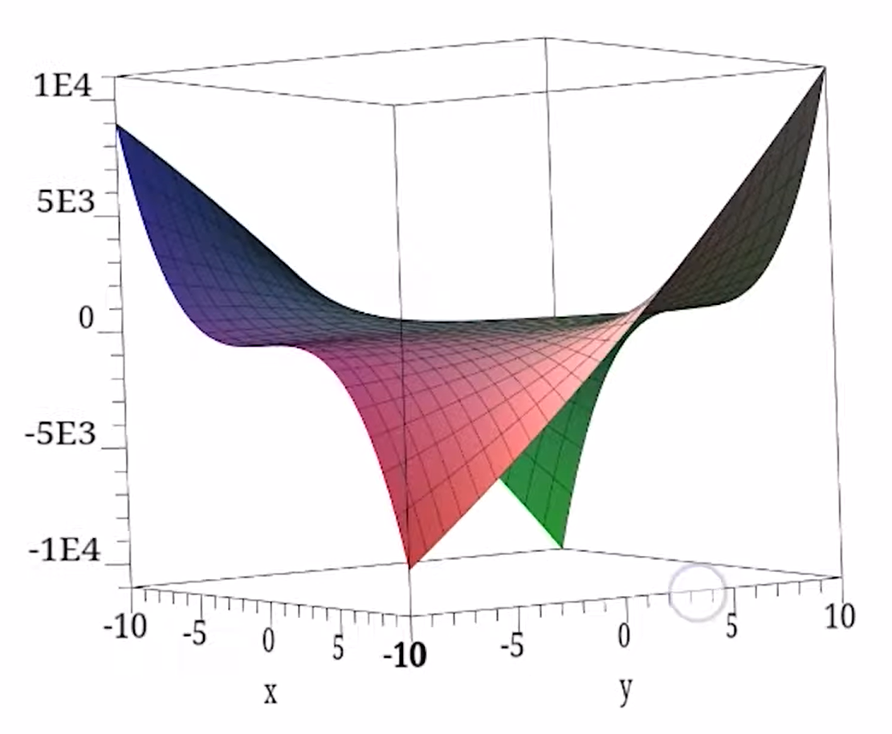
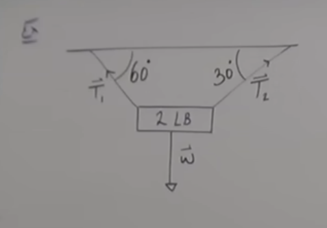
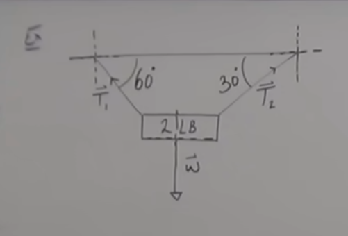

# Calc 3

## Contents

[Definitions](#Definitions) 

### Definitions

### Partial Differentiation

Differentiate a fn of more than one variable 
standard derivative: $\dfrac{df}{dx} = \lim_{h \to 0}(\dfrac{f(x+h) - f(x)}{h})$ 
 
With this, can only see the how f(x) is changing 
With several variables: 
$z=f(x,y)$ gives a surface. Gradient changes in both x and y direction 
$z = xy^2 + yx^3$ 
 
Partial differentiation allows us to calculate rate of change for a given direction 
$\dfrac{\partial f}{\partial {x}} = \lim+{h \to 0}(\dfrac{f(x+h, y) - f(x, y)}{h})$ 
$\dfrac{\partial f}{\partial {y}} = \lim+{h \to 0}(\dfrac{f(x, y+h) - f(x, y)}{h})$ 

**Example 1**

$f(x,y) = xy^2 + yx^3$ 
$\partial {x} = y^2 + 3yx^2$ 
$\partial {y} = 2xy + x^3$

**Example 2**

$f(x,y) = (x^2 + 2x)sin(x^2+y) + e^{y-2x}$
$\dfrac{\partial f}{\partial x} = (x^2 + 2x)cos(x^2 + y)2x + (2x + 2)sin(x^2 + y) - 2e^{y-2x}$ 
$\dfrac{{\partial f}}{\partial {y}} = (x^2 + 2x)cos(x^2 + y) + e^{y-2x}$

**Example**

Find a vector where $||\vec{v}|| = 3$ and $\vec{v} || 2\vec{a} - 3\vec{b}$ when $\vec{a} = -3\hat{i} + 4\hat{j}$ and $\vec{b} = \hat{i} + 2\hat{j}$ 

1. Find parallel vector 
$2\vec{a} - 3\vec{b} = 2(-3\hat{i} + 4\hat{j}) - 3(\hat{i} + 2\hat{j}) = -6\hat{i} + 8\hat{j} - 3\hat{i} - 6\hat{j} = -9\hat{i} + 2\hat{j}$
2. Find the unit vector of new vector 
$\hat{u} = \dfrac{-9\hat{i} + 2\hat{j}}{\sqrt{9^2 2^2}} = \lt \dfrac{-9}{\sqrt{85}}, \dfrac{2}{\sqrt{85}} >$ 
3. Force the magnitude to be 3 
$||\vec{v}|| = 3 = \lt \dfrac{-27}{\sqrt{85}}, \dfrac{6}{\sqrt{85}}>$

**Example**

 
Goal: Find $\vec{T}_1$ and $\vec{T}_2$ 

Things I know: 
1. Forces are equal and opposite 
$\vec{w} = -(\vec{T}_1 + \vec{T}_2)$ 
2. Magnitude is the weight

Draw x,y axis around angles: 
 
$\vec{w} = 2cos(270)\hat{i} = 2cos(\dfrac{3 \pi}{2})\hat{i} + 2sin(\dfrac{3 \pi}{2})\hat{j} = -2\hat{j}$ 

Angle of $\vec{T}_1 = 2 \pi - \dfrac{\pi}{3} = \dfrac{5\pi}{3}$ 
$-||\vec{T}_1||(cos(\dfrac{5\pi}{3})\hat{i} + sin(\dfrac{5\pi}{3})\hat{j}) = - ||\vec{T}_1||(\dfrac{1}{2}\hat{i} - \dfrac{\sqrt{3}}{2}\hat{j})$

Angle of $\vec{T}_2 = \pi + \dfrac{\pi}{6} = \dfrac{7\pi}{6}$ 
$-||\vec{T}_2||(cos(\dfrac{7\pi}{6})\hat{i} + sin(\dfrac{7\pi}{6})\hat{j}) = - ||\vec{T}_2||(\dfrac{\sqrt{3}}{2}\hat{i} + \dfrac{1}{2}\hat{j})$

Sub back in to equation: $\vec{w} = -(\vec{T}_1 + \vec{T}_2)$ 
$-2\hat{j} = - (- ||\vec{T}_1||(\dfrac{1}{2}\hat{i} - \dfrac{\sqrt{3}}{2}\hat{j}) - ||\vec{T}_2||(\dfrac{\sqrt{3}}{2}\hat{i} + \dfrac{1}{2}\hat{j}))$ 
$= -\dfrac{||\vec{T}_1||}{2}\hat{i} + \dfrac{||\vec{T}_1|| \sqrt{3}}{2}\hat{j} + \dfrac{||\vec{T}_2|| \sqrt{3}}{2}\hat{i} + \dfrac{||\vec{T}_2||}{2}\hat{j}$ 

Since $\vec{w}$ has no $\hat{i}$: 
$0 = -\dfrac{||\vec{T}_1||}{2} + \dfrac{||\vec{T}_2|| \sqrt{3}}{2}$ 

And 
$2 = \dfrac{||\vec{T}_1|| \sqrt{3}}{2} + \dfrac{||\vec{T}_2||}{2}$

$||\vec{T}_1|| = 1$ and $||\vec{T}_2|| = \sqrt{3}$

### Distance Formula

$P_1(x_1, y_1, z_1) + P_2(x_2, y_2, z_2)$
$d(P_1, P_2) = \sqrt{(x_2 - x_1)^2 + (y_2 - y_1)^2 + (z_2 - z_1)^2}$

### Midpoint

$\dfrac{x_1 + x_2}{2}, \dfrac{y_1 + y_2}{2}, \dfrac{z_1+ z_2}{2}$

### Sphere

$(x-h)^2 + (y-k)^2 + (z - l)^2 = r^2$ 
Where the center is $(h, k, l)$ and the radius $=r$

