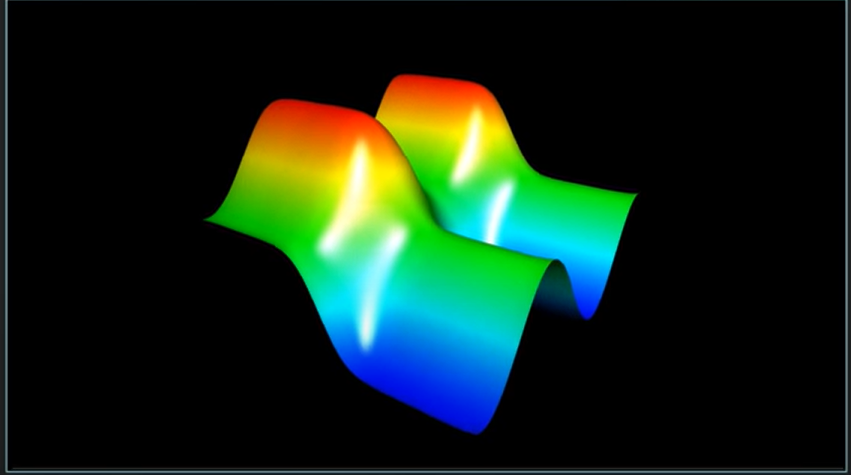

# Differential Equations

## Contents

[Definitions](#Definitions) 

### Definitions

X Order Differential Equations - Where X is the number of the highest derivative taken. Eg. Second order Differential Equation $\ddot{x}(t) = -\mu \dot{x}(t) - \omega x(t)$

### Types

Ordinary Differential Equations: ODE's: One input 
$\ddot{\theta}(t) = -\mu \dot{\theta}(t) - \dfrac{g}{L}sin(\theta(t))$ 
Input is $t$ 

Partial Differential Equations: PDE's: Multiple inputs 
$\dfrac{\partial {T}}{\partial t}(x, y, t) = \dfrac{\partial^2 T}{\partial x^2}(x, y, t) + \dfrac{\partial^2 T}{\partial y^2}(x,y,t)$ 
Multiple inputs are (x, y, t) 
 

### Laplacian

$\dfrac{\partial T}{\partial t} = \alpha (\dfrac{\partial^2 T}{\partial x^2} + \dfrac{\partial^2 T}{\partial y^2} + \dfrac{\partial^2 T}{\partial z^2}) = \nabla^2 T$   Multivariable version of second derivative, divergence of the gradient. 

### Fourier Series

$c_n = \int^{1}_{0} e^{-2\pi i n t} f(t) dt$