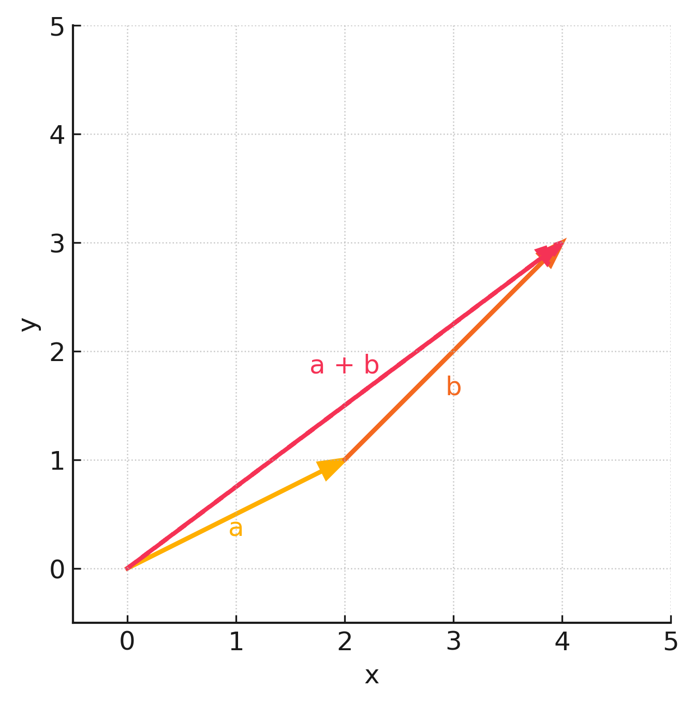
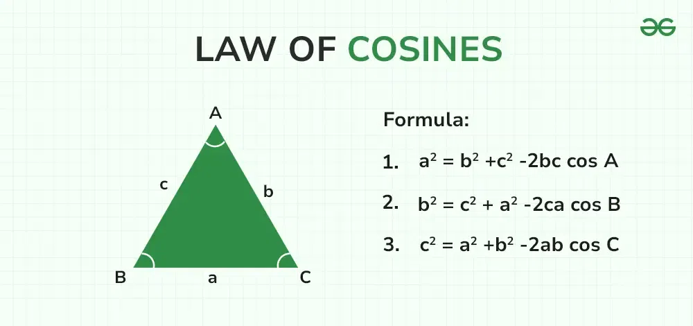

$\left[\begin{smallmatrix} 1 \\\\ 2 \end{smallmatrix}\right]$

Block:

$$
\begin{bmatrix} 1 \\ 2 \end{bmatrix}
$$

# Geometry of Linear Equations
[Geometry of Linear Equations (PDF)](PDFs/Geometry%20of%20Linear%20Equations.pdf)

## Contents

[Definitions](#Definitions) 

### Definitions

### Vectors

vector - magnitude and direction 
Ex. velocity

$$
\vec{v} = (5, 0) =
\begin{bmatrix} 5 \\ 0 \end{bmatrix}
= \begin{bmatrix} x \\ y \end{bmatrix}
$$

$\mathbb{R}^2$ = real coordinate space (2D) All possible real-valued 2-tuple

### Adding Vectors/Matrices

Geometrically: 
 
Computationally: 
 

Scalar multiples have the same direction and are parallel lines 
$\vec{a} = \begin{bmatrix} 2 \\ 1 \end{bmatrix} \qquad \parallel \qquad 3\vec{a} = \begin{bmatrix} 6 \\ 3 \end{bmatrix} = 3 \begin{bmatrix} 2 \\ 1 \end{bmatrix} \qquad \parallel \qquad -1\vec{a} = \begin{bmatrix} -2 \\ -1 \end{bmatrix}$

Magnitude: magnitude of original $\vec{v} \cdot |{scalar}| = ||c\cdot \vec{v}|| = |c| \cdot ||\vec{v}||$ 
Direction: opposite directions are 180$^{\circ}$

> Unit Vectors

$\hat{i} = \begin{bmatrix} 1 \\ 0 \\ 0 \end{bmatrix} \qquad \hat{j} = \begin{bmatrix} 0 \\ 1 \\ 0 \end{bmatrix} \qquad \hat{k} = \begin{bmatrix} 0 \\ 0 \\ 1\end{bmatrix}$ 
Unit $\vec{v}$ in any direction of $\vec{v}$ with magnitude of 1 
$\dfrac{\vec{v}}{||\vec{v}||}$

### Linear Combination

$S = v_{1}, v_{2}, ..., v_{n}$ in $\mathbb{R}$ is linearly dependent if and only if $c_{1} v_{1}, c_{2} v_{2}, ..., c_{n}v_{n}$ in $\mathbb{R} = 0$ for some $c_{i}$ where at least one is non-zero.

**Proof**

Assume $c_1 \neq 0$ 
$v_{1} + \dfrac{c_2}{c_1}v_2 + ... + \dfrac{c_n}{c_1}v_n = 0$ 
$v_1 = -\dfrac{c_2}{c_1}v_2 - ... - \dfrac{c_n}{c_1}v_n$ 
Since $v_1$ can be written as a combination of the other vectors which are non-zero, it must be linearly dependent.

### Subspace

V is a subspace of $\mathbb{R}$ if:
1. Closure under scalar multiplication 
If $\vec{x} \in V$ then $c\vec{x} \in V$ 
2. Closure under addition 
If $\vec{a} \in V, \vec{b} \in V$ then $\vec{a} + \vec{b} \in V$
3. Must contain the zero vector
Implied when $c=0$

If $V = Span \{\vec{V}_{1}, \vec{V}_{2}, ..., \vec{V}_{n}\}$ is linearly independent and V is a subspace, then S is a basis for V 

### Basis

Minimum set of vectors that span the subspace. Must be able to construct any vector 

### Dot Product

$\vec{a} \cdot \vec{b} =$ scalar 
$\begin{bmatrix} a_1 \\ a_2 \\ . \\ . \\ . \\ a_n \end{bmatrix} \cdot \begin{bmatrix} b_1 \\ b_2 \\ . \\ . \\ . \\ b_n \end{bmatrix} = a_1 b_1 + a_2 b_2 + ... + a_n b_n$ 

### Length

$||\vec{a}|| = \sqrt{a_{1}^{2} + a_{2}^{2} + ... + a_{n}^2}$

### Cauchy-Schwartz

Let $\vec{x}, \vec{y} \in \mathbb{R}^{n}$ 
$|\vec{x} \cdot \vec{y}| \leq ||\vec{x}||||\vec{y}||$ 
$|\vec{x} \cdot \vec{y}| = ||\vec{x}||||\vec{y}||$ only when $\vec{x} = \vec{y}$ 

**Proof**

Prove $|\vec{x} \cdot \vec{y}| \leq ||\vec{x}||||\vec{y}||$ 
 
$p(t) = || t\vec{y} - \vec{x}||^2 \geq 0$ any magnitude must be $\geq 0$ 
$= (t\vec{y} - \vec{x}) \cdot (t\vec{y} - \vec{x})$ side note: $||\vec{v}||^2 = \vec{v} \cdot \vec{v}$ 
Due to the associative property of multiplication: 
$t\vec{y} \cdot t\vec{y} - \vec{x} \cdot t\vec{y} - t\vec{y} \cdot \vec{x} + (-\vec{x}) \cdot (-\vec{x})$ 
$=(\vec{y} \cdot \vec{y})t^2 - 2(\vec{x} \cdot \vec{y})t + (\vec{x} \cdot \vec{x}) \geq 0$ 
Let $(\vec{y} \cdot \vec{y}) = a$, $2(\vec{x} \cdot \vec{y}) = b$ and $(\vec{x} \cdot \vec{x}) = c$  
$= at^2 -bt +c \geq 0$ -> pythagorean 
 
$p\left(\dfrac{b}{2a}\right) = \dfrac{ab^2}{4a^2} - \dfrac{b \cdot b}{2a} + c \geq 0$ 
 
$= \dfrac{b^2}{4a} - \dfrac{b^2}{2a} + c \geq 0$  
 
$= \dfrac{b^2 -2b^2}{4a} + c \geq 0$ 
Sub back in -> $4ac \geq b^2$ 
$4(\vec{y} \cdot \vec{y}) = 4||\vec{y}||^2 ||\vec{x}||^2 \geq 4(\vec{x} \cdot \vec{y})^2$ 
Taking the square root of both sides gives the absolute value 
$||\vec{y}||||\vec{x}|| \geq |\vec{x} \cdot \vec{y}| \qquad \square$

Prove $|\vec{x} \cdot \vec{y}| = ||\vec{x}||||\vec{y}||$ only when $\vec{x} = \vec{y}$ 
 
$|\vec{x} \cdot \vec{y}| = |c\vec{y} \cdot \vec{y}| = |c||\vec{y} \cdot \vec{y}| = |c|||\vec{y}||^2$ 
$=|c|||\vec{y}||||\vec{y}|| = ||c\vec{y}||||\vec{y}|| = ||\vec{x}||||\vec{y}|| \qquad \square$ 

### Triangle Inequality

$|| \vec{x} + \vec{y} ||^2 \leq || \vec{x}^2 || + 2 || \vec{x} || || \vec{y} || + || \vec{y} ||^2$ 
$\leq (|| \vec{x} || ||\vec{y}||^2)$
-> $||\vec{x} + \vec{y}|| \leq ||\vec{x}|| + ||\vec{y}||$

### Angle between vectors

Using the Law of Cosines: 
 
With $\vec{a}, \vec{b}, \vec{c} \in \mathbb{R}^n$ and non-zero 
and $\vec{c} = \vec{a} - \vec{b}$ 
$||\vec{a} - \vec{b} || ^2 = ||\vec{a} \cdot \vec{a} - 2\vec{a} \cdot \vec{b} + \vec{b} \cdot \vec{b} = ||\vec{a}$