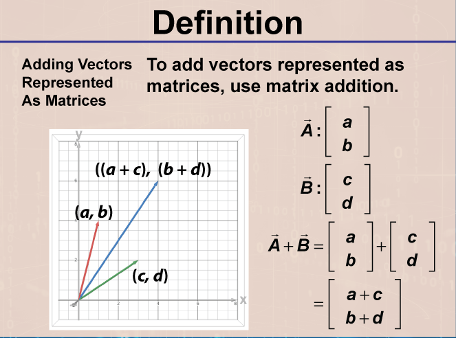
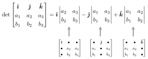

# Geometry of Linear Equations
[Geometry of Linear Equations (PDF)](PDFs/Geometry%20of%20Linear%20Equations.pdf)

## Contents

[Definitions](#Definitions) 

### Definitions

### Vectors

vector - magnitude and direction 
Ex. velocity

$$
\vec{v} = (5, 0) =
\begin{bmatrix} 5 \\\\ 0 \end{bmatrix}
= \begin{bmatrix} x \\\\ y \end{bmatrix}
$$

$\mathbb{R}^2$ = real coordinate space (2D) All possible real-valued 2-tuple

### Adding Vectors/Matrices

Geometrically: 
 
Computationally: 
 

Scalar multiples have the same direction and are parallel lines 
$$
\vec{a} = \begin{bmatrix} 2 \\\\ 1 \end{bmatrix} \qquad \parallel \qquad 3\vec{a} = \begin{bmatrix} 6 \\\\ 3 \end{bmatrix} = 3 \begin{bmatrix} 2 \\\\ 1 \end{bmatrix} \qquad \parallel \qquad -1\vec{a} = \begin{bmatrix} -2 \\\\ -1 \end{bmatrix}
$$

Magnitude: magnitude of original $\vec{v} \cdot |{scalar}| = ||c\cdot \vec{v}|| = |c| \cdot ||\vec{v}||$ 
Direction: opposite directions are 180$^{\circ}$

> Unit Vectors

$$
\hat{i} = \begin{bmatrix} 1 \\\\ 0 \\\\ 0 \end{bmatrix} \qquad \hat{j} = \begin{bmatrix} 0 \\\\ 1 \\\\ 0 \end{bmatrix} \qquad \hat{k} = \begin{bmatrix} 0 \\\\ 0 \\\\ 1\end{bmatrix}
$$

Unit $\vec{v}$ in any direction of $\vec{v}$ with magnitude of 1 
$\dfrac{\vec{v}}{||\vec{v}||}$

### Linear Combination

$S = v_{1}, v_{2}, ..., v_{n}$ in $\mathbb{R}$ is linearly dependent if and only if $c_{1} v_{1}, c_{2} v_{2}, ..., c_{n}v_{n}$ in $\mathbb{R} = 0$ for some $c_{i}$ where at least one is non-zero.

**Proof**

Assume $c_1 \neq 0$ 
$v_{1} + \dfrac{c_2}{c_1}v_2 + ... + \dfrac{c_n}{c_1}v_n = 0$ 
$v_1 = -\dfrac{c_2}{c_1}v_2 - ... - \dfrac{c_n}{c_1}v_n$ 
Since $v_1$ can be written as a combination of the other vectors which are non-zero, it must be linearly dependent.

### Subspace

V is a subspace of $\mathbb{R}$ if:
1. Closure under scalar multiplication 
If $\vec{x} \in V$ then $c\vec{x} \in V$ 
2. Closure under addition 
If $\vec{a} \in V, \vec{b} \in V$ then $\vec{a} + \vec{b} \in V$
3. Must contain the zero vector
Implied when $c=0$

If $V = Span \{\vec{V}_{1}, \vec{V}_{2}, ..., \vec{V}_{n}\}$ is linearly independent and V is a subspace, then S is a basis for V 

### Basis

Minimum set of vectors that span the subspace. Must be able to construct any vector 

### Dot Product

$$
\vec{a} \cdot \vec{b} = scalar
$$ 
$$
\begin{bmatrix} a_1 \\\\ a_2 \\\\ . \\\\ . \\\\ . \\\\ a_n \end{bmatrix} \cdot \begin{bmatrix} b_1 \\\\ b_2 \\\\ . \\\\ . \\\\ . \\\\ b_n \end{bmatrix} = a_1 b_1 + a_2 b_2 + ... + a_n b_n
$$

### Length

$||\vec{a}|| = \sqrt{a_{1}^{2} + a_{2}^{2} + ... + a_{n}^2}$

### Cauchy-Schwartz

Let $\vec{x}, \vec{y} \in \mathbb{R}^{n}$ 
$|\vec{x} \cdot \vec{y}| \leq ||\vec{x}||||\vec{y}||$ 
$|\vec{x} \cdot \vec{y}| = ||\vec{x}||||\vec{y}||$ only when $\vec{x} = \vec{y}$ 

**Proof**

Prove $|\vec{x} \cdot \vec{y}| \leq ||\vec{x}||||\vec{y}||$ 
 
$p(t) = || t\vec{y} - \vec{x}||^2 \geq 0$ any magnitude must be $\geq 0$ 
$= (t\vec{y} - \vec{x}) \cdot (t\vec{y} - \vec{x})$ side note: $||\vec{v}||^2 = \vec{v} \cdot \vec{v}$ 
Due to the associative property of multiplication: 
$t\vec{y} \cdot t\vec{y} - \vec{x} \cdot t\vec{y} - t\vec{y} \cdot \vec{x} + (-\vec{x}) \cdot (-\vec{x})$ 
$=(\vec{y} \cdot \vec{y})t^2 - 2(\vec{x} \cdot \vec{y})t + (\vec{x} \cdot \vec{x}) \geq 0$ 
Let $(\vec{y} \cdot \vec{y}) = a$, $2(\vec{x} \cdot \vec{y}) = b$ and $(\vec{x} \cdot \vec{x}) = c$  
$= at^2 -bt +c \geq 0$ -> pythagorean 
 
$p\left(\dfrac{b}{2a}\right) = \dfrac{ab^2}{4a^2} - \dfrac{b \cdot b}{2a} + c \geq 0$ 
 
$= \dfrac{b^2}{4a} - \dfrac{b^2}{2a} + c \geq 0$  
 
$= \dfrac{b^2 -2b^2}{4a} + c \geq 0$ 
Sub back in -> $4ac \geq b^2$ 
$4(\vec{y} \cdot \vec{y}) = 4||\vec{y}||^2 ||\vec{x}||^2 \geq 4(\vec{x} \cdot \vec{y})^2$ 
Taking the square root of both sides gives the absolute value 
$||\vec{y}||||\vec{x}|| \geq |\vec{x} \cdot \vec{y}| \qquad \square$

Prove $|\vec{x} \cdot \vec{y}| = ||\vec{x}||||\vec{y}||$ only when $\vec{x} = \vec{y}$ 
 
$|\vec{x} \cdot \vec{y}| = |c\vec{y} \cdot \vec{y}| = |c||\vec{y} \cdot \vec{y}| = |c|||\vec{y}||^2$ 
$=|c|||\vec{y}||||\vec{y}|| = ||c\vec{y}||||\vec{y}|| = ||\vec{x}||||\vec{y}|| \qquad \square$ 

### Triangle Inequality

$|| \vec{x} + \vec{y} ||^2 \leq || \vec{x}^2 || + 2 || \vec{x} || || \vec{y} || + || \vec{y} ||^2$ 
$\leq (|| \vec{x} || ||\vec{y}||^2)$
-> $||\vec{x} + \vec{y}|| \leq ||\vec{x}|| + ||\vec{y}||$

### Angle between vectors

Using the Law of Cosines: 
 
With $\vec{a}, \vec{b}, \vec{c} \in \mathbb{R}^n$ and non-zero 
and $\vec{c} = \vec{a} - \vec{b}$ 
$||\vec{a} - \vec{b} || ^2 = ||\vec{a} \cdot \vec{a} - 2\vec{a} \cdot \vec{b} + \vec{b} \cdot \vec{b} = ||\vec{a}||^2 + ||\vec{b}||^2 - 2\vec{a}\vec{b}$ 
$||\vec{a}||^2 + ||\vec{b}||^2 -2\vec{a}\vec{b} = ||\vec{a}||^2 + ||\vec{b}||^2 - 2||\vec{a}||||\vec{b}||cos \theta$ 
$(\vec{a} \cdot \vec{b}) = ||\vec{a}||||\vec{b}||cos \theta$ 
if $\vec{a} = c\vec{b}$  
$c> 0 -> \theta = 0\degree$ 
$c<0 -> \theta = 180\degree$

### Perpendicular or Orthogonal

$\vec{a}. \vec{b}$ when $\theta = 90\degree = \dfrac{\pi}{2}$ 
$\vec{a} \cdot \vec{b} = 0$ where $\vec{a}, \vec{b} \neq 0$ 
Orthogonal -> may be 0 

### Equation of a Plane in $R^3$

 
$Ax + By +Cz = D$ 
$\vec{n} = $ normal, perpendicular to all points on the plane 
$\vec{n} \cdot \vec{a} = 0$  
$$
\vec{x}_0 = \begin{bmatrix} x_0 \\\\ y_0 \\\\ z_0 \end{bmatrix}
$$
$$
\vec{x} = \begin{bmatrix} x \\\\ y \\\\ z \end{bmatrix}
$$
$\vec{x} - \vec{x_0}$ must be $\perp$ to $\vec{n}$
$$
\vec{n} = \begin{bmatrix} n_1 \\\\ n_2 \\\\ n_3 \end{bmatrix}
$$
$\vec{n} \cdot (\vec{x} - \vec{x_0}) = 0 -> Ax +By +Cz = D$

**Find equation of Plane**

$$
\vec{n} = \begin{bmatrix} 1 \\\\ 3 \\\\ -2 \end{bmatrix},
\vec{x_0} = \begin{bmatrix} 1 \\\\ 2 \\\\ 3 \end{bmatrix}
$$
Next, find any point on the plane which will be $\vec{x}$ 
$\vec{n} \cdot (\vec{x} - \vec{x_0}) = 0$
$$
\vec{n} \cdot \begin{bmatrix} x - 1 \\\\ y -2 \\\\ z -3 \end{bmatrix} = 0
$$
$(x-1) + 3(y-2) - 2(z-3) = 0$ 
$x-1 +3y - 6 - 2z +6 = 0$ 
$x+3y - 2z = 1$ 

### Cross Product

**Definition** Finds a mutually orthogonal vector. Maximum when perpendicular, minimum when colinear 
$|| \vec{a} X \vec{b} || = ||\vec{a}||||\vec{b}||sin\theta$ 
Area = $||\vec{a} X \vec{b}||$

 

### Dot Product

**Definition** How much of the vector is going in the same direction. Maxes out when colinear, minimum when perpendicular

### Finding shortest distance from a point to a plane

Let $\vec{n}$ be the normal vector and $\vec{f}$ be a vector from the plane. Let D be the distance. 
$\dfrac{\vec{n} \cdot \vec{f}}{|\vec{n|}} = d$ 
Or 
$\dfrac{Ax_0 + By_{0} + Cz_0 - D}{\sqrt{A^2 + B^2 + C^2}}$ 
If the distance between the plane $Ax - 2y + z = d$ 
and the plane containing the lines $L_1 = \dfrac{x-1}{2} = \dfrac{y-2}{3} = \dfrac{z-3}{4}$ and $L_2 = \dfrac{x-2}{3} = \dfrac{y-3}{4} = \dfrac{z-4}{5}$ 
is $\sqrt{6}$, then what is $|d|$? 
 
Answer: 
What we know
1. $\vec{n} = A\hat{i} - 2\hat{j} + \hat{k}$
2. $||\vec{n}|| = \sqrt{6}

$\sqrt{A^2 - 4 + 1} = \sqrt{A^2 - 3}$ 
$=(A + \sqrt{3})(A-\sqrt{3})$ 
$\sqrt{6} = \sqrt{(A + \sqrt{3})(A-\sqrt{3})}$ 
$6 = A^2 +3$ 
$A = \sqrt{3}$ 
Find points on lines, only need 3 points for 2 vectors 
$L_1 = 0 -> (1,2,3)$ 
$L_2 = 0 -> (2, 3, 4)$ 
$L_1 = 1 -> (3,5,7)$ 
$\vec{a} = L_1 = 1 - L_1 = 0$ 
$= 2\hat{i} + 3\hat{j} + 4\hat{k}$ 
$\vec{b} = L_2 = 0 - L_1 = 0$ 
$= \hat{i} + \hat{j} +\hat{k}$ 
$\vec{a} X \vec{b} = \vec{n}$ to find linked plane 
$$
= \begin{vmatrix} \hat{i} & \hat{j} & \hat{k} \\\\ 2 & 3 & 4 \\\\ 1 & 1 & 1 \end{vmatrix} = (3-4)\hat{i} - (2-4)\hat{j} +(2-3)\hat{k} = \hat{i} + 2\hat{j} - \hat{k}
$$
Find equation for $\vec{n}$ 
$(x, y, z) \cdot \vec{n}$ 
$\vec{n} \cdot ((x-3)\hat{i} + (y-5)\hat{j} + (z-7)\hat{k})=0$ 
$3-x+2y-10+7 -z = 0$ 
$-x+2y-z=0$ -> Equation of second plane parallel and first plane 
Get it to match using system of equations: 
$Ax-2y+z=d$ 
$-x + 2y - z = 0$ 
$x - 2y + z = 0$ 
$A = 1$ and $d = 0$ 
To find distance: 
$(1, 2, 3)$ 
$Ax - 2y + z = d$ 
$\dfrac{1 - 4 + 3 = d}{\sqrt{1^2 + 4 + 1}} = \dfrac{-d}{\sqrt{6}} = \sqrt{6}$ 
$d = 6$