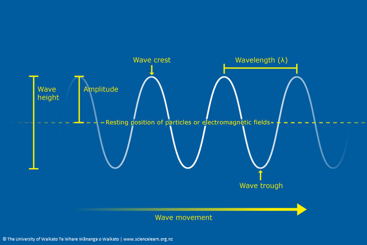
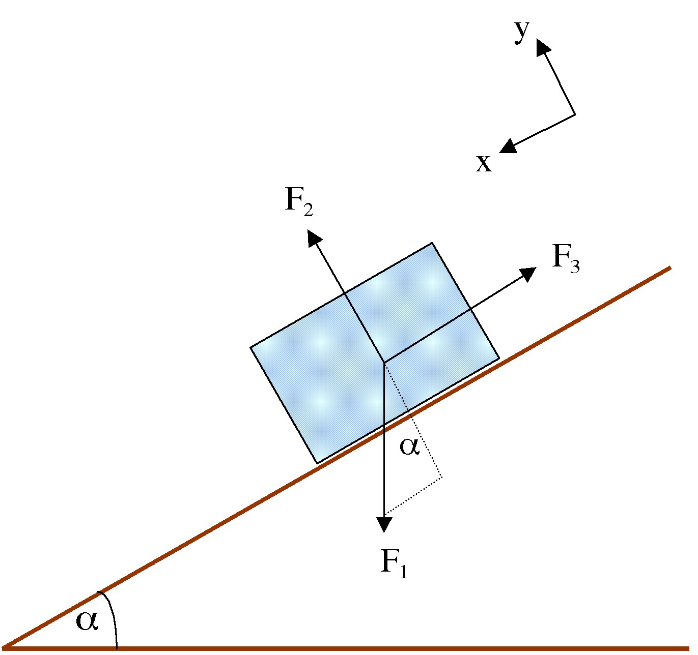

# Physics

## Contents

[Definitions](#Definitions) 
[Fields](#fields) 
[Energy](#energy) 
[Waves](#waves) 
[Forces](#forces) 
[Free Body Diagrams](#free-body-diagrams)

### Definitions

> Force

A push or pull on an object. Force is a vector quantity with both magnitude and direction. Unit of measurement is N - newton 
$F = ma$

> Net Force

Sum of all forces on an object 
$\sum{\vec{F}}$ 
Acceleration = $\vec{a} = \frac{{}\sum \vec{F}}{m}$ 
$\sum \vec{F} = \frac{\Delta \vec{\rho}}{\Delta t}$ 
Momentum = $\vec{\rho} = m \vec{v} \frac{kgm}{s}$ 

> Speed

The rate at which an object covers distance, or the distance traveled per unit of time. 
$s = \frac{distance}{time}$

> Position

The location of an object in space at a given time, relative to a reference point (or origin). 
$r(t)$

> Velocity

A vector quantity that describes both the speed and direction of an object's motion 
$v(t) = \frac{dr}{dt}$
$\vec{v} = \frac{\Delta \vec{x}}{\Delta t}$ 

> Acceleration

The rate at which an object's velocity changes over time 
$a(t) = \frac{dv}{dt} = \frac{d^{2}r}{dt^2}$ 
$\vec{a} = \frac{\Delta \vec{v}}{\Delta t} = \frac{v_{f} - v_{i}}{\Delta t}$

### Fields

An empty space around an object where a non-contact force (gravity, electric, magnetic) could exist 

> Scalar Fields
 
A single numerical value (a scalar) at each point in space.  
1. Temperature
2. Density
3. Pressure

> Vector Fields

These fields have both a magnitude (strength) and a direction at each point in space. 
1. Electric - Objects with charge
2. Gravitational - Around objects with mass
3. Magnetic - Objects with magnetic force
4. Velocity
5. Force

> Tensor Fields

The most general type, encompassing scalar and vector fields as special cases. They describe quantities that require multiple components to be fully represented, often involving relationships between different directions.  
1. Stress-energy tensor in general relativity 
2. Inertia tensor
3. Electromagnetic - materials that become magnets in presence of electricity. Can also be represented as two vector fields.
   
### Energy
 
> Kinetic Energy

Energy which a body possesses by virtue of being in motion 
$E_k = \frac{1}{2}mv^2$ 
Where: 
m - mass of the object 
v - speed of the object in a specific direction 

> Potential Energy

Stored energy an object possesses due to its position or configuration within a force field 
$E_p = mgh$ 
Where:  
m = mass of the object  
g = acceleration due to gravity 
h = height

### Waves

A disturbance that transfers energy through a medium or space without transferring matter. It's a propagating dynamic disturbance  
 

> Amplitude

The maximum displacement of a point on the wave from its equilibrium or resting position 
As a wave loses energy, amplitude decreases 
$A = \frac{Max - Min}{2}$ 
Energy = $A^2$
$x = Asin(\omega[t-K]) +b$ 
With: 
x = oscillating variable 
$\omega$ = angular frequency, a scalar measure of rotation rate = $2\pi f$ 
t = time 
K = arbitrary constant representing time offset 
b = arbitrary constant representing displacement offset

> Period T[s]  

Time it takes for one wave cycle to complete 

> Wavelength $\lambda$[m] 

The distance between identical points on adjacent waves 
$\lambda = \frac{v}{\lambda}$

> Frequency 

The number of times a wave occurs per unit of time 
$f = \frac{1}{T}$ 
$f = \frac{v}{\lambda}$ 
With: 
T - Period 
v - wave speed 
$\lambda$ - wavelength 
Larger frequency -> More energy 
Higher frequencies bent more with refraction

>Speed

$v[\frac{distance}{time}] = \frac{\Delta \vec{x}}{\Delta t}$ 
$v = \lambda[\frac{distance}{cycle}] \cdot f[\frac{cycle}{time}] = \lambda \cdot f [\frac{m}{s}]$ 

Factors affecting wave speed:
1. Wave type - EM faster than sound wave
2. Density - Denser mediums generally slow down wave propagation. This is because more massive particles require more energy to be set in motion and transfer the wave's energy. For example, sound waves travel slower in air (less dense) than in water (denser). 
3. Elasticity - Elasticity refers to a material's ability to return to its original shape after being deformed. A more elastic medium allows waves to travel faster because the restoring force is stronger, facilitating quicker energy transfer. Solids are generally more elastic than liquids, which are more elastic than gases. 
4. Temperature - Temperature affects the speed of waves, particularly in gases and liquids. Higher temperatures mean particles have more kinetic energy, leading to faster collisions and wave propagation. For instance, sound travels faster in warmer air. 

> Reflection

The phenomenon where waves change direction upon encountering a boundary between two different mediums. This occurs when waves, such as light, sound, or water waves, bounce back after hitting a surface that acts as a barrier. The angle of incidence (the angle at which the wave approaches the boundary) is equal to the angle of reflection (the angle at which the wave bounces back).  
 

> Absorption

 The process where a wave's energy is transferred to a medium it interacts with, causing the medium's atoms and molecules to vibrate. This transferred energy can be converted into other forms, like heat, or can be used to change the medium's state. Essentially, the wave loses energy as it travels through or interacts with the medium.  
 

> Mechanical Waves

A disturbance that travels through a medium, transferring energy by the oscillation of particles within that medium. Require a physical medium like solids, liquids, or gases to propagate. 

Sound:
1. Frequency = pitch
2. Amplitude = loudness
Sound wave types:
1. Analog - continuous, infinite values
2. Digital - discrete, finite values 
 

> Electromagnetic Waves

A form of radiation that travels through space as oscillating electric and magnetic fields. These waves don't require a medium to propagate and can travel through a vacuum, like outer space.  

Light:
1. Frequency = color
2. Amplitude = brightness

### Forces

> Applied $F_{A}$

A force exerted on an object by another object or a person. It can cause a change in the object's motion, direction, or shape
1. Pushing a door
2. Kicking a ball
3. Lifting a box

>Tension $F_{T}$

A pulling force transmitted axially through a flexible connector, like a rope or string, when it's stretched or pulled tight
1. Ropes/cables/strings
2. Tendons connecting muscles to bones

> Gravitational $F_{G}$ 

The fundamental force of attraction between any two objects with mass. Earth's gravity is 9.8$m/s^2$
1. Planetary orbits
2. Falling objects
3. Tidal forces
   
> Normal $\perp : F_{N}$ 

The support force exerted by a surface when an object rests on it, acting perpendicular to the surface. Only exists when two objects are touching
1. A book resting on a table
2. A person standing on the floor
3. A car on a level road

> Frictional $F{f}$ 

The force that opposes motion between two surfaces in contact. Always parallel to the surfaces in contact and act in the direction that opposes motion
1. Driving
2. Walking

> Thrust $F_{Th}$ 

A mechanical force that moves an object forward, most commonly associated with aircraft propulsion. A direct application of Newton's third law (for every action, there is an equal and opposite reaction)
1. Propellers
2. Jet Engines
   
> Drag $F_{d}$

The force that opposes the motion of an object moving through a fluid (liquid or gas). It's a type of friction caused by the interaction between the object and the fluid, and it always acts in the opposite direction of the object's movement
1. Air resistance
2. Swimming

> Buoyant $F_{b}$ 

The upward force exerted by a fluid (like water or air) on an object submerged in it. This force opposes the object's weight, and it's the reason why things can float. The magnitude of the buoyant force is equal to the weight of the fluid displaced by the object
1. Floating in water
2. A balloon

> Lift $F_{L}$ 

The mechanical force that acts on an object moving through a fluid (like air or water), causing it to move upwards or perpendicular to the direction of the fluid flow
1. Airplanes
2. Helicopter rotors
3. Spinning baseballs

### Free Body Diagrams

 
